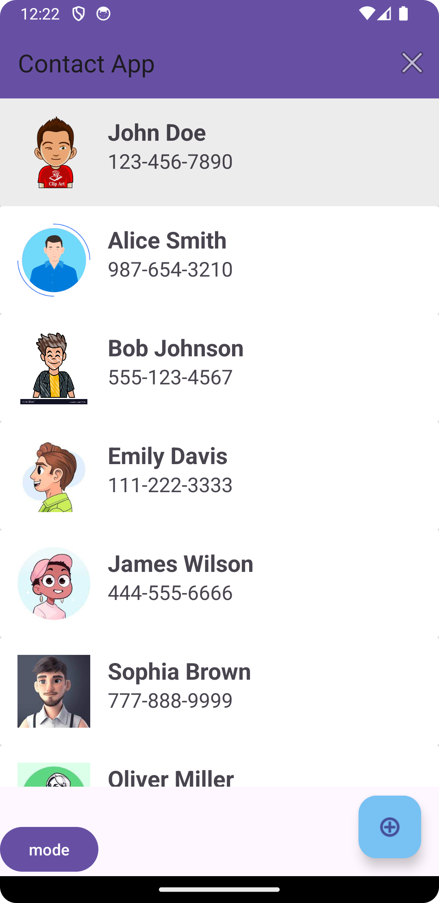
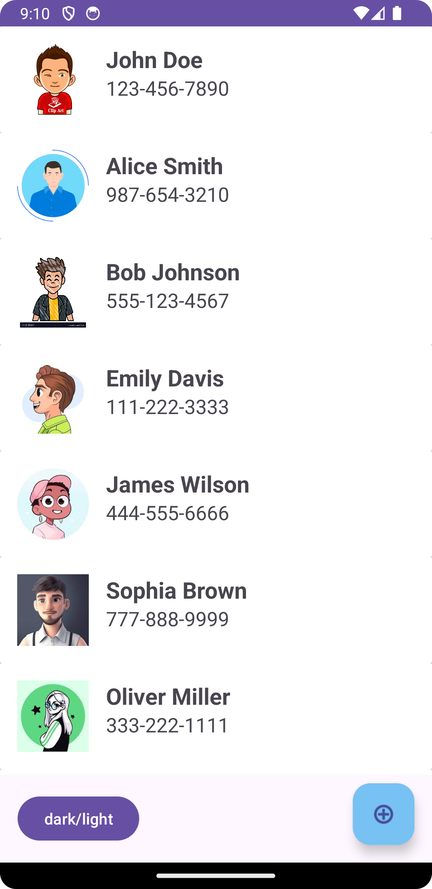

# Contact List App



This is a simple contact list Android application built to showcase the implementation of a RecyclerView, animations, and CRUD (Create, Read, Update, Delete) operations.

## Features

- **RecyclerView Implementation:** Utilizes RecyclerView to display a list of contacts efficiently.
- **Animations:** Implements animations for smooth transitions and interactions within the app.
- **CRUD Operations:** Provides functionality to Create, Read, Update, and Delete contacts.





Clone the repository using the following command:

```bash
git clone https://github.com/your-username/contact-list-app.git

